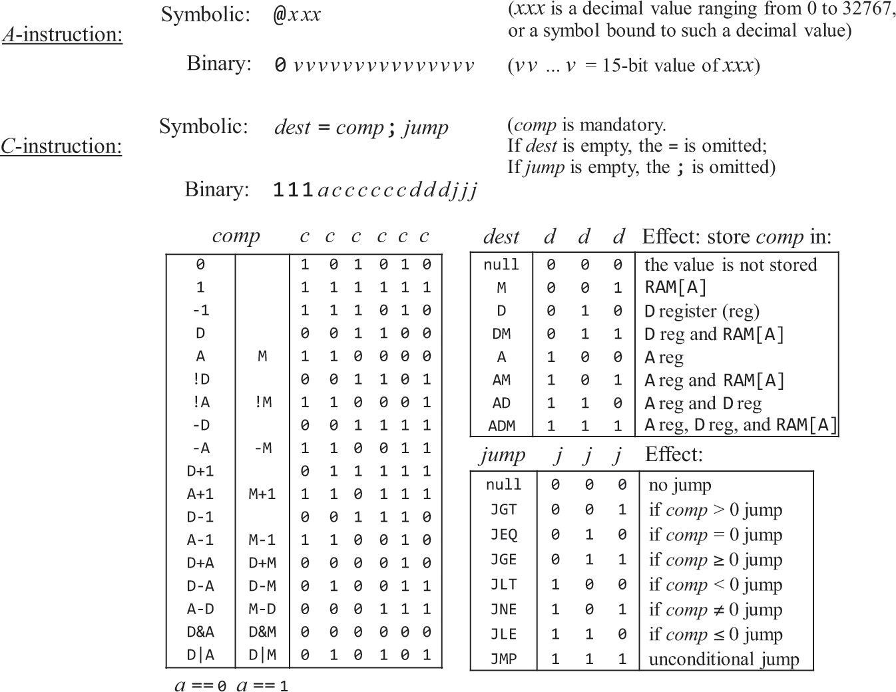

# Hack Machine Assembler
Assembler para o Hack Assembly Language[^7], feito em C para o projeto #6 do curso [Nand2Tetris](https://www.nand2tetris.org/).
O curso Nand2Tetris visa construir um computador de uso geral a partir do portão lógico [Nand](https://en.wikipedia.org/wiki/NAND_gate) até o famoso jogo de Tetris.


## Tabela de Conteúdo
- [Hack Machine Language](#hack-machine-language)
    - [A-Instruction](#a-instruction)
    - [C-Instruction](#c-instruction)
        - [comp](#comp)
        - [dest](#dest)
        - [jump](#jump)
    - [Símbolos](#símbolos)
        - [Predefinidos](#predefinidos)
        - [Rótulos](#rótulos)
        - [Variáveis](#variáveis)
    - [Convenções de sintaxe e de formato de arquivos](#convenções-de-sintaxe-e-de-formato-de-arquivos)
        - [Arquivos com código binário](#arquivos-com-código-binário)
        - [Arquivos com código assembly](#arquivos-com-código-assembly)
    - [Exemplo de programa em linguagem simbólica](#exemplo-de-programa-em-linguagem-simbólica)
- [Hack Computer](#hack-computer)
    - [CPU](#cpu-(central-processing-unit))
        - [ALU](#alu-(arithmetic-logical-unit))
        - [Registros](#registros)
            - [Data](#data)
            - [Address](#address)
            - [PC](#program-counter)
    - [ROM](#rom)
    - [RAM](#ram)
    - [SCREEN](#screen)
    - [KEYBOARD](#keyboard)
- [Uso](#uso)
- [Cobertura de testes](#cobertura-de-testes)
- [Autores](#autores)
- [Licensa](#licensa)
- [Notas](#notas)


## Hack Machine Language 
Consiste em duas instruções, especificadas na seguinte imagem:


### A-Instruction
Modifica o registro A para um valor de 15 bits. A versão binária consiste em dois campos, **opcode** e
o valor não negativo em binário. Por exemplo: ``@5`` ou ``0000000000000101`` em binário, armazena o 
valor 5 no registro A.

É usado para três operações:
- acessar valores constantes[^6]
- acessar um registo de memória e consequentemente seu valor
- selecionar um endereço caso o *jump* ocorra

### C-Instruction
Diz o que computar, onde armazenar e o que será feito a seguir. Na versão binária o bit mais à esquerda
é o **opcode** dessa instrução, que é 1. Os próximos dois bits não são utilizados e por convenção são 
deixados com o valor de 1. Os próximos 7 bits são os de ***comp***utação. Os próximos 3 bits são de 
***dest***ino e os últimos 3 são para a instrução de ***jump***.

#### comp
O Hack ALU foi projetado para computar um conjunto fixo de funções dado dois inputs de 16 bits. Apesar
de potencialmente poder computar até 128 funções[^3], apenas 28 funções são listadas na especificação.

Exemplos:
1. Para computar o valor de D menos 1, olhando a [espeficicação](#hack-machine-language), isso pode ser 
feito utilizando a instrução simbólica ``D-1``, que equivale em binário 111<ins>0001110</ins>000000.

1. Para computar o *bitwise or* entre os valores de D e de M, podemos utilizar a instrução simbólica ``D|M``
, que equivale em binário 111<ins>1010101</ins>000000.

#### dest
Campo opcional, pode ser utilizado para armazenar o resultado da computação nos 3 registros simultaneamente.
O primeiro *d-bit* diz se deve armazenar o resultado no registro A, o segundo no D e o terceiro no M, 
que é o registro de memória selecionado naquele momento.

Exemplo: caso se queira incrementar um valor que está na mémoria, é preciso selecionar o registro da 
memória com que se irá trabalhar e depois realizar as operações necessárias:
```
    0000000000000111 // @7
    1111110111011000 // DM=M+1
```
Observe que neste caso, o resultado também é salvo no registro D, que geralmente é utilizado para 
operações futuras.

#### jump
A execução das instruções geralmente seguem-se uma após a outra, o campo *jump* permite que esse 
fluxo seja alterado, porém antes é necessário dizer qual instrução será executada, caso a condição 
seja realizada, com um A-instruction. O *jump* incondicional, realiza-se com ``0;JMP``, o que em 
binário equivale a ``1110000000000111``.

Observação: como uma A-instruction seleciona tanto um endereço na RAM como ROM, e fazemos uso dele na 
C-instruction, seja para acessar o valor da RAM ou para realizar um *jump*, como boa prática não se 
faz referência ao registro M quando se tem uma instrução de *jump*.


### Símbolos
Utilizados para representar endereços na memória RAM ou ROM. São divididos em três categorias:
- Predefinidos
- Rótulos
- Variáveis

Pode ser qualquer qualquer sequência de letras, dígitos, ``_``, ``.``, ``$`` e ``:`` que não
comece com um dígito.

#### Predefinidos
- R0 a R15 ``RAM[0] até a RAM[15]``
- SP[^4] ``RAM[0]``
- LCL[^4] ``RAM[1]``
- ARG[^4] ``RAM[2]``
- THIS[^4] ``RAM[3]``
- THAT[^4] ``RAM[4]``
- SCREEN ``RAM[16384]``
- KBD ``RAM[24576]``

#### Rótulos
Declarados ``(LABEL)``, liga o símbolo ``LABEL`` ao endereço da próxima instrução. Instruções *jump*
que fazem uso dos rótulos podem aparecer em qualquer parte do programa, inclusive antes deles serem
declarados. Como convenção, os rótulos são escritos em letras maiúsculas. É uma pseudo-instrução já
que nenhum código binário é gerado a partir dela.

#### Variáveis
Qualquer símbolo que não seja predefinido ou que seja um rótulo é tratado como variável. Ela é associada
a um endereço de memória RAM decidido pelo assembler, por ordem de aparição começando pelo endereço 
``RAM[16]``. Como convenção, as variáveis são escritas em letras minúsculas.

### Convenções de Sintaxe e de Formato de Arquivos

#### Arquivos com código binário
São escritos na Hack Machine Language, amarzenados em texto com a extensão ``hack``, por exemplo 
``Prog.hack``. Cada linha do arquivo contém uma instrução, usando uma sequência de 16 dígitos de 0 
ou 1. Quando um programa é carregado na memória de instrução, cada instrução é associada ao número 
respectivo da linha que está no arquivo começando pelo 0.

#### Arquivos com código assembly
São escritos na simbólica Hack Assembly Language, amarzenados em texto com a extenção ``asm``, por 
exemplo ``Prog.asm``. O arquivo é composto por instruções A e C, declaração de rótulos e comentários.
Os comentários podem ser feitos usando ``//`` no início da linha. Espaços em branco e linhas em 
branco são ignorados. Todos os [mnemônicos](#hack-machine-language) da linguagem símbolica devem ser 
escritos em letras maiúsculas. 

### Exemplo de Programa em Linguagem Simbólica

<details>
    <summary>Ver código</summary>

```
// This file is part of www.nand2tetris.org
// and the book "The Elements of Computing Systems"
// by Nisan and Schocken, MIT Press.
// File name: projects/4/Mult.asm

// Multiplies R0 and R1 and stores the result in R2.
// (R0, R1, R2 refer to RAM[0], RAM[1], and RAM[2], respectively.)
// The algorithm is based on repetitive addition.

    // n = R1
    @R1
    D=M
    @n
    M=D

    // v = R0
    @R0
    D=M
    @v
    M=D

    // i = 0
    @i
    M=0

    // R2 = 0 - assert correct value
    @R2
    M=0

(LOOP)
    // if i == n goto END
    @i
    D=M
    @n
    D=D-M
    @END
    D;JEQ

    // R2 = R2 + v
    @R2
    D=M 
    @v
    D=D+M
    @R2
    M=D

    // i++
    @i
    M=M+1

    @LOOP
    0;JMP

(END)
    @END
    0;JMP
```
</details>

## Hack Computer
É uma implementação em 16 bits da [máquina de Von Neumann](https://en.wikipedia.org/wiki/Von_Neumann_architecture) 
projetada para executar programas escritos em Hack Machine Language. Para realizar a tarefa, ela é composta por:
- CPU
- ROM 32k
- RAM 16K + 8K + 2 byte (ou 1 word)
- SCREEN
- KEYBOARD

<details>
    <summary>ver imagem</summary>


</details>


### CPU (Central Processing Unit)
Responsável pela execução das instruções dos programas, cada instrução diz a CPU que computação
realizar, que registro acessar e qual instrução será a próxima. É composta por ALU e um conjunto 
de registros.

A CPU é projetado para executar instruções A e C, sendo A os 16 bits são tratados como binários e 
armazenados na registro A; sendo C, é tratada como uma "cápsula" de bits de controle que especifica
várias microoperações para serem realizadas em várias partes da CPU.

<details>
    <summary>ver imagem</summary>


</details>

#### ALU (Arithmetic Logical Unit)
É o chip que realiza as operações lógicas e matemáticas de baixo nível que são próprias da implementação
do Hack Computer. A quantidade de funcionalidades em grande parte é uma decisão de projeto, as que não
forem implementadas no hardware são implementadas via software, com o custo de se tornarem mais lentas
pois precisam de mais ciclos para serem concluídas.

<details>
    <summary>ver imagem</summary>


</details>

#### Registros
Para que cálculos sejam feitos, é necessário que dados intermediários sejam guardados. Em tese esses dados
poderiam ser amarzenados na RAM, o problema é que a RAM é outro chip e isso aumentaria consideravelmente o
tempo de execução. Os registros funcionam como uma memória de baixa latência, porém são mais caros por
residirem dentro da CPU, por isso costumam suportar pouca informação. No caso dessa CPU há apenas 3 
registros: **D**ata, **A**ddress e **P**rogram **C**ounter.

<details>
    <summary>ver imagem</summary>


</details>

##### Data
Usado para amarzenar valores.

##### Address
Usado para amarzenar valores ou selecionar um endereço de instrução ou na memória RAM.

##### Program Counter
Usado para controlar qual instrução será executada.

<details>
    <summary>ver imagem</summary>


</details>

### ROM
O chip é semelhante ao da RAM, com a exceção de ser uma memóra de leitura somente, é utilizada 
para carregar os programas que serão executados no Hack Computer. Também de 32K.

<details>
    <summary>ver imagem</summary>


</details>

### RAM
Utilizada como memória de uso geral, possui 32k endereços de registros de 16 bits[^2], também funciona
como interface entre a CPU e os dispositivos de entrada/saída do computador. Os dois dispositivos, SCREEN
e KEYBOARD interagem com o computador a partir de áreas mapeadas nesta memória.

<details>
    <summary>ver imagem</summary>


</details>

### SCREEN
Usado como dispositivo de saída, a tela é mapeada na RAM nos endereços de 16,384 a 24,575, possui uma
resolução de 512x256, cores preto ou branco, totalizando 8k[^1] bits de informação. É continuamente 
atualizada para refletir as mudanças que são feitas no seu espaço de memória por uma lógica externa 
ao computador.

Cada linha da tela começa no canto superior esquerdo e é representado por 32 *words* consecutivas. 
Seguindo a convenção, o canto superior esquerdo é considerada a linha 0 e coluna 0. Para encontrar
um pixel em específico, na linha l, coluna c, utiliza-se a fórmula ``c % 16`` (do LSB ao MSB)[^5] da 
*word* mapeada na ``RAM[SCREEN + l*32 + col/16]``. O pixel pode ser lido ou escrito, sendo 1 para
preto e 0 para branco.

### KEYBOARD
Usado como dispositivo de entrada, é mapeado na RAM no endereço 24,576 e reflete a tecla que está sendo
pressionada no teclado físico, usado para leitura somente.

<details>
    <summary>Conjunto de teclas Hack</summary>


</details>


## Uso
- Tenha o [Ceedling](https://www.throwtheswitch.org/ceedling#get-ceedling-section) instalado.
- Obtenha uma cópia do repositório ``git clone https://github.com/RenanGalvao/hack-machine-assembler.git``.
- Entre na pasta e execute o build ``cd hack-machine-assembler && ceedling release``.

Para gerar o código ``hack``, utilize dentro da pasta raiz: ``./build/release/assembler <source-file>``. 
Caso não tenha nenhum tipo de erro no código fonte, o arquivo ``.hack`` estará na mesma pasta que o código fonte.


## Cobertura de Testes

<table class="legend">
    <tbody><tr>
      <th scope="row">Directory:</th>
      <td>src/</td>
    </tr>
    <tr>
      <th scope="row">Date:</th>
      <td>2025-03-20 14:10:30</td>
    </tr>
    <tr>
      <th scope="row">Coverage:</th>
      <td class="legend">
        <span class="coverage-low">low: ≥ 0%</span>
        <span class="coverage-medium">medium: ≥ 75.0%</span>
        <span class="coverage-high">high: ≥ 90.0%</span>
      </td>
    </tr>
  </tbody></table>

<table class="coverage">
    <tbody><tr>
      <th></th>
      <th scope="col">Exec</th>
      <th scope="col">Total</th>
      <th scope="col">Coverage</th>
    </tr>
    <tr>
      <th scope="row">Lines:</th>
      <td>388</td>
      <td>425</td>
      <td class="coverage-high">91.3%</td>
    </tr>
    <tr>
      <th scope="row">Functions:</th>
      <td>28</td>
      <td>28</td>
      <td class="coverage-high">100.0%</td>
    </tr>
    <tr>
      <th scope="row">Branches:</th>
      <td>125</td>
      <td>154</td>
      <td class="coverage-medium">81.2%</td>
    </tr>
  </tbody></table>

<table class="file-list">
  <colgroup><col>
  </colgroup><colgroup span="3">
  </colgroup><colgroup span="2">
  </colgroup><colgroup span="2">

  </colgroup><tbody><tr>
    <th scope="col">File</th>
    <th scope="colgroup" colspan="3">Lines</th>
    <th scope="colgroup" colspan="2">Functions</th>
    <th scope="colgroup" colspan="2">Branches</th>
  </tr>


  <tr>
    <th scope="row">
      code.c
    </th>
    <td>
      <meter class="coverage-high" min="0" max="100" value="97.7" title="97.7%">97.7</meter>
    </td>
    <td class="CoverValue line-coverage coverage-high">97.7%</td>
    <td class="CoverValue line-coverage coverage-high">42 / 43</td>
    <td class="CoverValue function-coverage coverage-high">100.0%</td>
    <td class="CoverValue function-coverage coverage-high">4 / 4</td>
    <td class="CoverValue branch-coverage coverage-high">90.0%</td>
    <td class="CoverValue branch-coverage coverage-high">9 / 10</td>
  </tr>


  <tr>
    <th scope="row">
      hash-map.c
    </th>
    <td>
      <meter class="coverage-low" min="0" max="100" value="70.8" title="70.8%">70.8</meter>
    </td>
    <td class="CoverValue line-coverage coverage-low">70.8%</td>
    <td class="CoverValue line-coverage coverage-low">63 / 89</td>
    <td class="CoverValue function-coverage coverage-high">100.0%</td>
    <td class="CoverValue function-coverage coverage-high">2 / 2</td>
    <td class="CoverValue branch-coverage coverage-low">59.1%</td>
    <td class="CoverValue branch-coverage coverage-low">26 / 44</td>
  </tr>


  <tr>
    <th scope="row">
      parser.c
    </th>
    <td>
      <meter class="coverage-high" min="0" max="100" value="97.7" title="97.7%">97.7</meter>
    </td>
    <td class="CoverValue line-coverage coverage-high">97.7%</td>
    <td class="CoverValue line-coverage coverage-high">84 / 86</td>
    <td class="CoverValue function-coverage coverage-high">100.0%</td>
    <td class="CoverValue function-coverage coverage-high">3 / 3</td>
    <td class="CoverValue branch-coverage coverage-high">97.2%</td>
    <td class="CoverValue branch-coverage coverage-high">35 / 36</td>
  </tr>


  <tr>
    <th scope="row">
      tables.c
    </th>
    <td>
      <meter class="coverage-high" min="0" max="100" value="100.0" title="100.0%">100.0</meter>
    </td>
    <td class="CoverValue line-coverage coverage-high">100.0%</td>
    <td class="CoverValue line-coverage coverage-high">72 / 72</td>
    <td class="CoverValue function-coverage coverage-high">100.0%</td>
    <td class="CoverValue function-coverage coverage-high">4 / 4</td>
    <td class="CoverValue branch-coverage coverage-high">100.0%</td>
    <td class="CoverValue branch-coverage coverage-high">2 / 2</td>
  </tr>


  <tr>
    <th scope="row">
      utils.c
    </th>
    <td>
      <meter class="coverage-high" min="0" max="100" value="94.1" title="94.1%">94.1</meter>
    </td>
    <td class="CoverValue line-coverage coverage-high">94.1%</td>
    <td class="CoverValue line-coverage coverage-high">127 / 135</td>
    <td class="CoverValue function-coverage coverage-high">100.0%</td>
    <td class="CoverValue function-coverage coverage-high">15 / 15</td>
    <td class="CoverValue branch-coverage coverage-medium">85.5%</td>
    <td class="CoverValue branch-coverage coverage-medium">53 / 62</td>
  </tr>
</tbody></table>
Generated by: GCOVR (Version 5.2)


## Autores
- [@RenanGalvao](https://www.github.com/RenanGalvao)


## License
MIT


## Notas
[^1]: Para cada pixel é utilizado apenas um bit e cada um deles possui 2 possibilidades, portanto:
(512x256 / 8 ) / 2 = 8192 bytes ou 8kb em binário.

[^2]: Na prática é possível acessar até o endereço <= 0x6000.

[^3]: 2^7 = 128.

[^4]: Usados no código intermediário gerados com o Jack Compiler.

[^5]: O bit mais significado é o primeiro da esquerda.

[^6]: Os valores constantes vão de 0 até 32767 (2^15 - 1).

[^7]: Linguagem simbólica da [Hack Machine Language](#hack-machine-language).
